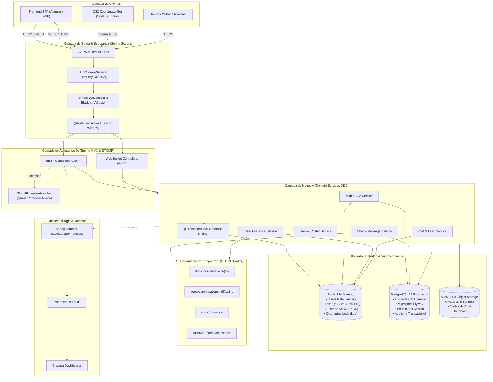
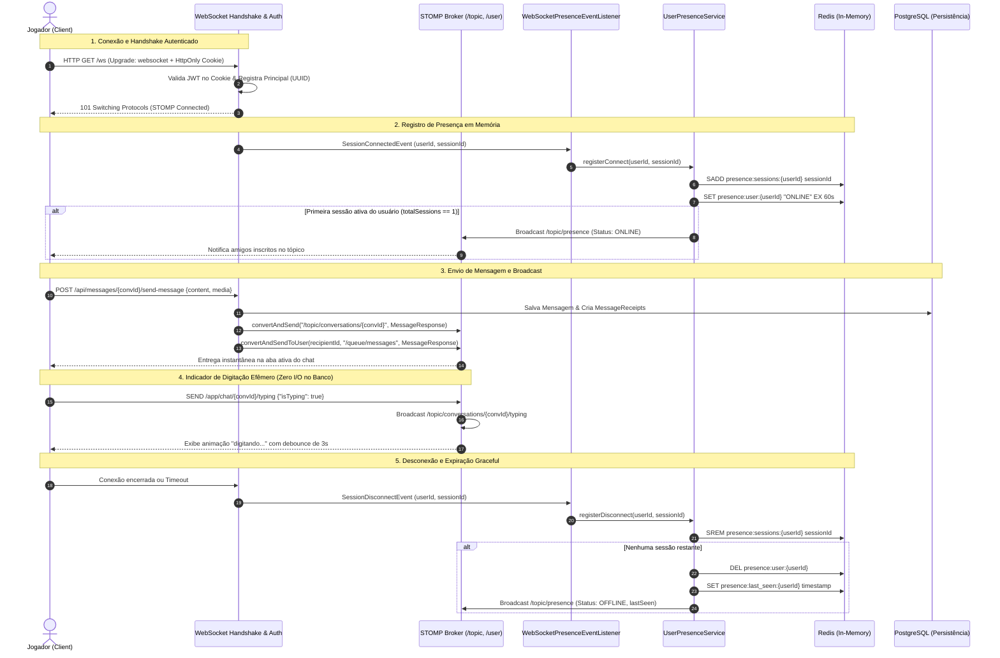
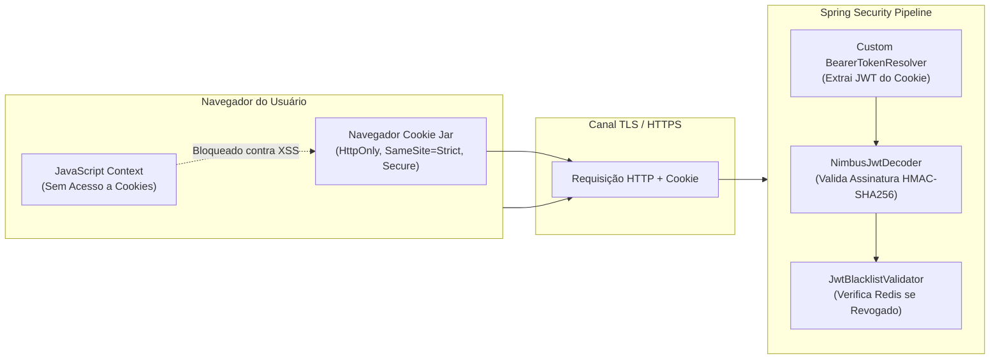

# Kyofuse Architecture ⚡

<div align="center">

[](https://opensource.org/licenses/MIT)
[](https://openjdk.org/)
[](https://spring.io/projects/spring-boot)
[](https://spring.io/projects/spring-security)
[](https://www.postgresql.org/)
[](https://redis.io/)
[](https://stomp.github.io/)
[](https://min.io/)
[](https://www.docker.com/)
[-success.svg)](https://junit.org/)
[](https://prometheus.io/)

**Estudo de Caso Técnico e Arquitetura de Software: Plataforma Social e Hub Competitivo de Baixa Latência**

[Visão Geral](#-visão-geral-e-contexto-de-engenharia) • [Arquitetura](#-arquitetura-do-sistema) • [Decisões Técnicas](#-decisões-técnicas-e-trade-offs-adrs) • [Contratos de API](#-especificação-de-apis-e-contratos) • [Infraestrutura Local](#-infraestrutura-local-docker-compose) • [Testes Automatizados](#-qualidade-e-testes-automatizados)

</div>

---

## 📖 Visão Geral e Contexto de Engenharia

O **Kyofuse** é um ecossistema social e competitivo de alta performance projetado para a comunidade global de **Counter-Strike 2 (CS2)**. A plataforma resolve o problema de fragmentação na formação de elencos táticos, organização de comunidades temáticas, acompanhamento de métricas competitivas em tempo real e comunicação instantânea de baixa latência.

Diferente de redes sociais generalistas, o sistema opera com requisitos estritos de:
1. **Consistência de Domínio:** Regras complexas de recrutamento de times baseadas em funções táticas (*AWPer, IGL, Entry Fragger, Support, Lurker*), elegibilidade de patentes e integridade de membros.
2. **Tempo Real e Baixa Sobrecarga:** Mensageria instantânea com confirmação de entrega e leitura, indicador de digitação efêmero e rastreamento de presença online/offline de jogadores.
3. **Segurança de Nível Bancário (Defense-in-Depth):** Armazenamento em repouso com criptografia simétrica AES-256-GCM, blind indexing determinístico para buscas seguras (LGPD/GDPR), proteção anti-brute force via Sliding Window Rate Limiting no Redis e renovação de sessões com Refresh Token Rotation e detecção de reuso.

O repositório **kyofuse-arch** consolida a especificação arquitetural, os padrões de projeto corporativos (*Enterprise Integration Patterns*), diagramas técnicos executáveis, contratos de API e a infraestrutura completa orquestrada via Docker Compose.

---

## 🏛️ Padrão Arquitetural: Monólito Modular (DDD)

A aplicação foi estruturada como um **Monólito Modular** guiado por **Domain-Driven Design (DDD)**. Em vez de adotar prematuramente uma arquitetura de microsserviços distribuídos — que adicionaria latência de rede, particionamento de banco de dados e sobrecarga operacional desnecessária no estágio inicial —, o sistema isola seus contextos delimitados (*Bounded Contexts*) em pacotes autônomos com responsabilidades estritas:

```
com.hokyozu.kyofuse/
├── admin/            # Dashboard administrativo, auditoria e métricas de infraestrutura
├── announcements/    # Comunicados globais do sistema e gerenciamento de banners
├── auth/             # Autenticação, 2FA TOTP, sessões ativas e troca rápida de contas
├── chat/             # Conversas diretas/grupos, mensagens, recibos e eventos STOMP
├── comments/         # Comentários encadeados do feed social
├── communities/      # Hubs competitivos públicos e privados, membros e convites
├── infrastructure/   # Adaptadores técnicos (Redis, Security, WebSockets, S3, GeoIP)
├── invites/          # Gerenciamento de convites formais para elencos competitivos
├── leaderboard/      # Ranking competitivo global e regional de jogadores
├── notifications/    # Notificações in-app orientadas a eventos
├── posts/            # Feed social, buffer assíncrono de visualizações e menções
├── presence/         # Presença em tempo real (Redis Sets e broadcast via WebSocket)
├── profiles/         # Perfis de jogadores, integração Steam/Faceit e estatísticas CS2
├── reactions/        # Reações polimórficas (Posts e Comentários)
├── relationships/    # Amizades, seguidores, bloqueios mútuos e políticas de privacidade
├── shared/           # Exceções transversais, manipulador global de erros e enums base
├── status/           # Health checks públicos e monitoramento de dependências
├── storage/          # Camada de abstração e pré-assinatura de mídias em S3/MinIO
├── support/          # Tickets de suporte ao usuário e relatórios de moderação
├── teams/            # Gestão de equipes competitivas, vagas táticas e agendamento
└── users/            # Gestão do ciclo de vida do usuário e regras de inativação
```

### Regras de Separação em Cada Módulo de Domínio:
- **`controller/`:** Exposição exclusiva de contratos HTTP REST ou canais STOMP. Zero lógica de persistência.
- **`dto/`:** Java Records imutáveis segregados em `request` e `response`, validados via Bean Validation (`@Valid`).
- **`entity/`:** Entidades JPA ricas com identificadores UUIDv4, auditoria temporal e mapeamento relacional.
- **`finder/`:** Camada especializada de leitura isolada para busca rápida de agregados com tratamento de exceções de não encontrado (`NotFoundException`).
- **`service/`:** Regras de negócio puras com transações atômicas controladas (`@Transactional`).
- **`validator/`:** Validadores desacoplados de regras de integridade de domínio (ex: limite de membros em times, elegibilidade de convites).
- **`mapper/`:** Mapeamento estático e determinístico de DTOs para Entidades e vice-versa, sem overhead de reflexão em tempo de execução.

---

## 🗺️ Arquitetura do Sistema

### 1. Visão Geral do Fluxo de Dados e Camadas



---

### 2. Fluxo em Tempo Real: WebSocket (STOMP) & Presença Distribuída



---

## ⚖️ Decisões Técnicas e Trade-offs (ADRs)

### 1. WebSocket (STOMP) vs. HTTP Polling

| Dimensão | HTTP Short/Long Polling | WebSocket com STOMP (Adotado) | Justificativa Arquitetural |
| :--- | :--- | :--- | :--- |
| **Overhead de Rede** | Cabeçalhos HTTP completos (500B – 2KB) a cada 2 segundos por cliente. | Frame STOMP mínimo (~50 bytes) sobre uma única conexão TCP persistente. | Redução drástica de largura de banda e custo de I/O em servidores para milhares de clientes conectados. |
| **Latência de Entrega** | Média de 1 a 3 segundos (dependente do intervalo de pooling). | Sub-milissegundos (Push reativo direto do servidor para o cliente). | Crítico para o chat de squads competitivos e notificações de status de partida. |
| **Custo de Recursos** | Milhares de requisições por minuto atingindo o pool de conexões do Tomcat e banco. | Conexões persistentes mantidas pelo broker STOMP sem chamadas a banco para eventos efêmeros. | Eventos de digitação (*typing indicator*) trafegam exclusivamente em memória via broker sem persistência. |
| **Roteamento de Canais** | Simulado via URLs e rotas REST dispersas. | Padrão Publish/Subscribe nativo com prefixos estruturados (`/topic`, `/queue`, `/user`). | Permite envio direcionado a um único usuário (`convertAndSendToUser`) ou broadcast de sala de squad. |

### 2. Estratégia de Dados Híbrida: Redis em Memória vs. PostgreSQL Relacional

A arquitetura adota o princípio de **segregação de volatilidade de dados**:

```
┌─────────────────────────────────────────────────────────────────────────────┐
│                           ESTRATÉGIA DE DADOS HÍBRIDA                       │
├──────────────────────────────────────┬──────────────────────────────────────┤
│      REDIS (In-Memory & Volátil)     │       POSTGRESQL (Fonte da Verdade)  │
├──────────────────────────────────────┼──────────────────────────────────────┤
│ • Rate Limiting via ZSet (Sliding)   │ • Entidades de Domínio e Relacionamentos│
│ • Presença Ativa (Sessões + TTL)     │ • Histórico Definitivo de Mensagens  │
│ • Buffer de Views de Posts (INCR)    │ • Perfis, Roster de Times e Vagas    │
│ • Locks Distribuídos (Redlock/Lua)   │ • Migrações Versionadas via Flyway   │
│ • Blacklist Instantânea de JWT       │ • Índices HMAC para Buscas LGPD      │
└──────────────────────────────────────┴──────────────────────────────────────┘
```

#### A. Rate Limiting com Sliding Window Log (Redis ZSet)
Em vez de algoritmos primitivos de *Fixed Window* (que sofrem de picos de borda nos limites do minuto), o `RedisRateLimiterService` utiliza conjuntos ordenados do Redis:
- Cada requisição é inserida com timestamp em milissegundos como score via `ZADD`.
- Registros anteriores à janela móvel (`now - windowSize`) são removidos atomicamente via `ZREMRANGEBYSCORE`.
- A cardinalidade (`ZCARD`) é comparada com o limite configurado. Em caso de violação, o tempo exato para liberação é retornado via cabeçalho HTTP `Retry-After`.

#### B. Buffer Assíncrono de Visualizações de Posts
Incrementar um contador relacional no PostgreSQL a cada visualização de post provocaria contenção severa de escrita (*row-level locks*) em posts populares.
- **Solução:** O `PostViewsBufferService` registra a visualização atomicamente no Redis com `INCR post:views:buffer:{id}` e deduplica por usuário via `SADD post:views:seen:{id} {userId}`.
- Um agendador assíncrono (`PostViewsFlushScheduler`) executa a sincronização em lotes (*bulk update*) para o banco a cada intervalo configurado, drenando o buffer e preservando o banco relacional.

#### C. Locks Distribuídos com Redlock e Script Lua
Para operações concorrentes críticas (como reivindicação da última vaga de um elenco ou transferências de liderança), utiliza-se o `RedisDistributedLockService`:
- Bloqueio via `SET key value NX PX leaseTime`.
- Liberação atômica estrita através de **Script Lua** que valida se o token de propriedade armazenado confere com o caller antes da deleção, impedindo a liberação acidental de um lock cujo lease já havia expirado:
  ```lua
  if redis.call('get', KEYS[1]) == ARGV[1] then
      return redis.call('del', KEYS[1])
  else
      return 0
  end
  ```

### 3. Estratégia de Segurança (Defense-in-Depth & Privacy-by-Design)



1. **Mitigação Absoluta de XSS com HttpOnly Cookies:**
   - O JWT Access Token e o Refresh Token viajam em cookies `HttpOnly`, `Secure` e `SameSite=Strict`. Scripts maliciosos executados no navegador do usuário não conseguem inspecionar nem extrair os tokens de autenticação.
2. **Refresh Token Rotation com Detecção de Reuso:**
   - Toda emissão de novo Access Token invalida imediatamente o Refresh Token utilizado e gera um novo na mesma linhagem familiar.
   - Caso um token antigo já revogado seja apresentado (indicativo de interceptação ou vazamento), o sistema invalida **toda a família de sessões** do usuário compulsoriamente.
3. **Criptografia Simétrica em Repouso com Blind Indexing (LGPD/GDPR):**
   - Dados sensíveis de identificação pessoal (como `email`) são gravados no banco cifrados com **AES-256-GCM** via JPA `AttributeConverter`.
   - Para permitir buscas exatas de login e impor restrições de unicidade (`UNIQUE constraint`) sem decifrar todo o banco, calcula-se um hash criptográfico determinístico cego com **HMAC-SHA256** (`email_index`) mantido em coluna indexada separada.
4. **Isolamento de Chaves para MFA (TOTP RFC 6238):**
   - O token provisório de transição para o desafio do 2FA é assinado com `MFA_JWT_SECRET`, uma chave isolada e distinta do `JWT_SECRET` principal, impedindo qualquer tentativa de elevação de privilégio em endpoints de negócio.

---

## 📡 Especificação de APIs e Contratos

### 1. Módulo: Autenticação & Sessões (`/api/auth`)

#### `POST /api/auth/login`
Autentica o usuário com credenciais ou retorna desafio MFA / Reativação.
- **Rate Limit:** 5 tentativas / 60 segundos por IP.
- **Request Body:**
  ```json
  {
    "usernameOrEmail": "fallen_cs",
    "password": "SuperSecretPassword123!"
  }
  ```
- **Response `200 OK` (Autenticado - Cookies `access_token` e `refresh_token` injetados):**
  ```json
  {
    "userId": "9b1deb4d-3b7d-4bad-9bdd-2b0d7b3dcb6d",
    "email": "f***@***.com",
    "username": "fallen_cs",
    "role": "USER",
    "switchToken": "eyJhbGciOiJIUzI1NiIsInR5cCI6IkpXVCJ9...",
    "trustedDevice": true
  }
  ```
- **Response `200 OK` (Desafio MFA Pendente):**
  ```json
  {
    "mfaToken": "mfa_pending_eyJhbGciOiJIUzI1NiIsInR5cCI6IkpXVCJ9..."
  }
  ```
- **Response `401 Unauthorized` / `429 Too Many Requests`**

#### `POST /api/auth/2fa/verify`
Valida o código TOTP do aplicativo autenticador e conclui a emissão das sessões.
- **Request Body:**
  ```json
  {
    "mfaToken": "mfa_pending_eyJhbGciOiJIUzI1NiIsInR5cCI6IkpXVCJ9...",
    "code": "482910"
  }
  ```
- **Response `200 OK`:** Payload de autenticação com cookies de sessão injetados.

#### `POST /api/auth/refresh`
Executa a rotação de tokens utilizando o cookie seguro `refresh_token`.
- **Response `200 OK`:** Novos cookies `access_token` e `refresh_token` definidos no cabeçalho `Set-Cookie`.

---

### 2. Módulo: Chat & Mensageria (`/api/messages` & WebSocket)

#### `POST /api/messages/{conversationId}/send-message`
Envia mensagem de texto e/ou anexos multimídia para uma conversa direta ou de grupo.
- **Rate Limit:** 30 mensagens / 60 segundos por usuário.
- **Request Body:**
  ```json
  {
    "content": "Bora treino no Mirage hoje às 20h?",
    "media": [
      {
        "mediaUrl": "https://storage.kyofuse.com/media/smokes-guide.png",
        "mediaType": "IMAGE",
        "fileSize": 1048576,
        "width": 1920,
        "height": 1080
      }
    ]
  }
  ```
- **Response `201 Created`:**
  ```json
  {
    "id": "e4f5a11c-2234-4b55-83f1-0987abcdef01",
    "conversationId": "3fa85f64-5717-4562-b3fc-2c963f66afa6",
    "senderId": "9b1deb4d-3b7d-4bad-9bdd-2b0d7b3dcb6d",
    "senderUsername": "fallen_cs",
    "senderNickname": "Professor",
    "content": "Bora treino no Mirage hoje às 20h?",
    "status": "SENT",
    "media": [
      {
        "id": "c1a2b3d4-0000-1111-2222-333344445555",
        "mediaUrl": "https://storage.kyofuse.com/media/smokes-guide.png",
        "mediaType": "IMAGE"
      }
    ],
    "createdAt": "2026-10-01T20:30:00Z"
  }
  ```

#### Canais WebSocket / STOMP:
- **`SUB /topic/conversations/{conversationId}`:** Recebe mensagens em tempo real da sala de chat.
- **`SUB /topic/conversations/{conversationId}/typing`:** Notificações de digitação (`{"userId": "...", "isTyping": true}`).
- **`SEND /app/chat/{conversationId}/typing`:** Emite status de digitação para a conversa.
- **`SUB /user/queue/messages`:** Fila privada do usuário para novas notificações de mensagens diretas e menções.

---

### 3. Módulo: Equipes Competitivas (`/api/teams`)

#### `POST /api/teams/create`
Cria uma equipe competitiva associada a vagas de funções táticas (*recruiting*).
- **Request Body:**
  ```json
  {
    "name": "Imperial Esports",
    "tag": "IMP",
    "description": "Elenco competitivo focado em campeonatos tier 2 e GC.",
    "country": "BR",
    "requiredRoles": ["AWPER", "ENTRY_FRAGGER"]
  }
  ```
- **Response `201 Created`:**
  ```json
  {
    "id": "6a9e8712-1402-4fc4-8d91-3158e0a12345",
    "name": "Imperial Esports",
    "tag": "IMP",
    "leaderId": "9b1deb4d-3b7d-4bad-9bdd-2b0d7b3dcb6d",
    "memberCount": 1,
    "maxMembers": 7,
    "requiredRoles": ["AWPER", "ENTRY_FRAGGER"],
    "createdAt": "2026-10-01T20:00:00Z"
  }
  ```

---

### 4. Módulo: Presença em Tempo Real (`/api/presence`)

#### `POST /api/presence/batch`
Consulta o status de presença (Online / Offline / Último Acesso) de múltiplos usuários em lote utilizando MGET no Redis para evitar consultas N+1.
- **Request Body:**
  ```json
  {
    "userIds": [
      "9b1deb4d-3b7d-4bad-9bdd-2b0d7b3dcb6d",
      "e4f5a11c-2234-4b55-83f1-0987abcdef01"
    ]
  }
  ```
- **Response `200 OK`:**
  ```json
  {
    "9b1deb4d-3b7d-4bad-9bdd-2b0d7b3dcb6d": {
      "userId": "9b1deb4d-3b7d-4bad-9bdd-2b0d7b3dcb6d",
      "status": "ONLINE",
      "lastSeen": "2026-10-01T20:38:15Z"
    },
    "e4f5a11c-2234-4b55-83f1-0987abcdef01": {
      "userId": "e4f5a11c-2234-4b55-83f1-0987abcdef01",
      "status": "OFFLINE",
      "lastSeen": "2026-10-01T18:14:02Z"
    }
  }
  ```

---

### 5. Contrato de Resposta de Erros Padronizada

Todas as exceções capturadas pelo `GlobalExceptionHandler` retornam um contrato RFC 7807 consistente:

```json
{
  "timestamp": "2026-10-01T20:45:00.123456Z",
  "status": 409,
  "error": "Conflict",
  "message": "Outra operação idêntica está em andamento. Tente novamente em instantes."
}
```

---

## 🐳 Infraestrutura Local (Docker Compose)

O arquivo [`docker-compose.yml`](file:///home/hokyozu/Documentos/Dev/kyofuse-arch/docker-compose.yml) provê todo o ecossistema de infraestrutura necessário para executar e testar o projeto localmente com **zero configuração prévia**.

### Serviços Orquestrados:

| Serviço | Imagem | Porta Local | Finalidade Técnica |
| :--- | :--- | :--- | :--- |
| **`postgres`** | `postgres:16-alpine` | `5432` | Banco relacional com healthchecks e volume de dados persistente. |
| **`redis`** | `redis:8-alpine` | `6379` | Armazenamento chave-valor de alta velocidade para presença, locks e rate-limits. |
| **`minio`** | `minio/minio:latest` | `9000` / `9001` | Object Storage compatível com AWS S3 para upload de avatares, banners e imagens. |
| **`minio-init`** | `minio/mc:latest` | — | Job one-shot que cria o bucket `kyofuse-media` e aplica política de download público. |
| **`mailpit`** | `axllent/mailpit:latest` | `1025` / `8025` | Mock SMTP local com painel web para inspecionar emails de ativação, redefinição e 2FA. |
| **`prometheus`** | `prom/prometheus:latest` | `9090` | Coletor de métricas que raspa periodicamente `/actuator/prometheus`. |
| **`grafana`** | `grafana/grafana:latest` | `3000` | Dashboards pré-provisionados com datasource Prometheus integrado. |

### Passo a Passo de Execução:

1. **Clone o repositório e acesse a raiz:**
   ```bash
   git clone https://github.com/Hosz/kyofuse-arch.git
   cd kyofuse-arch
   ```

2. **Crie o arquivo de variáveis de ambiente a partir do modelo:**
   ```bash
   cp .env.example .env
   ```

3. **Inicie os serviços de infraestrutura:**
   ```bash
   docker compose up -d
   ```

4. **Verifique o status de saúde dos contêineres:**
   ```bash
   docker compose ps
   ```

5. **Acesse as interfaces administrativas:**
   - **Mailpit (Painel de Emails):** [http://localhost:8025](http://localhost:8025)
   - **MinIO Console (S3 Storage):** [http://localhost:9001](http://localhost:9001) *(User: `kyofuse_storage_admin`, Pass: `kyofuse_storage_secret_key_123`)*
   - **Grafana (Dashboards):** [http://localhost:3000](http://localhost:3000) *(User: `admin`, Pass: `admin`)*
   - **Prometheus (Métricas brutas):** [http://localhost:9090](http://localhost:9090)

---

## 🧪 Qualidade e Testes Automatizados

A estabilidade da arquitetura é respaldada por uma suíte rigorosa de **mais de 167 classes de testes automatizados**, utilizando **JUnit 5**, **Mockito** (com `inline-mock-maker` para suporte a mocks avançados e classes finais), **AssertJ** e fatias de teste do Spring (`@WebMvcTest`, `@DataJpaTest`).

### Distribuição da Cobertura de Testes por Contexto Delimitado:

```
┌──────────────────────────────────────┬─────────────┬────────────────────────────────────┐
│ Módulo / Bounded Context             │ Testes Qtd  │ Foco da Validação Técnica          │
├──────────────────────────────────────┼─────────────┼────────────────────────────────────┤
│ infrastructure/ (Security, Crypto)   │ 29 classes  │ Criptografia AES-GCM, JWT, Redlock │
│ communities/                         │ 16 classes  │ Moderação, permissões e adesão     │
│ profiles/                            │ 16 classes  │ Sincronização Steam, CS2 analytics │
│ teams/                               │ 16 classes  │ Vagas táticas, limites de roster   │
│ chat/                                │ 15 classes  │ Recibos, STOMP broadcasts e ACL    │
│ auth/                                │ 14 classes  │ 2FA TOTP, Refresh Tokens, Cookies  │
│ posts/ & feed/                       │ 11 classes  │ Buffer de visualizações, menções   │
│ reactions/                           │ 08 classes  │ Idempotência de curtidas e emojis  │
│ relationships/                       │ 07 classes  │ Bloqueios mútuos e privacidade     │
│ comments/                            │ 07 classes  │ Encadeamento de respostas          │
│ users/ & account/                    │ 05 classes  │ Soft delete, reativação de contas  │
│ support/ & reports/                  │ 05 classes  │ Tickets e moderação de abusos      │
│ admin/ & audit/                      │ 05 classes  │ Relatórios mensais e auditoria     │
│ shared/ (Exceptions & Enums)         │ 03 classes  │ Respostas RFC 7807 e validação     │
│ leaderboard/                         │ 02 classes  │ Ordenação e paginação de ranks     │
│ notifications/                       │ 02 classes  │ Disparo de eventos transversais    │
│ presence/                            │ 02 classes  │ Ciclo de vida Redis e heartbeats   │
│ announcements/                       │ 02 classes  │ Vigência temporal de comunicados   │
│ status/                              │ 01 classe   │ Health checks e dependências       │
├──────────────────────────────────────┼─────────────┼────────────────────────────────────┤
│ TOTAL                                │ 167 classes │ Cobertura Integral de Regras       │
└──────────────────────────────────────┴─────────────┴────────────────────────────────────┘
```

### Filosofia dos Testes de Engenharia:
1. **Isolamento Transacional:** Testes de persistência executados com rollback automático para manter o banco idempotente entre execuções.
2. **Defesa contra Nullability e Edge Cases:** Cobertura de cenários de concorrência com locks simulados, validação de tokens adulterados ou expirados e tentativas de injeção de parâmetros.
3. **Mocks Restritos aos Limites de Entrada/Saída:** Testes unitários com Mockito focam no comportamento do serviço, enquanto validadores e mappers são testados de forma determinística pura sem mocks.

---

## 👨‍💻 Autor & Contato

Desenvolvido por **Gabriel (hokyozu)** — Engenheiro de Software focado no ecossistema Java, Spring Boot, Sistemas Distribuídos e Arquitetura de Software.

- **GitHub:** [@Hosz](https://github.com/Hosz)
- **LinkedIn:** [Gabriel no LinkedIn](https://www.linkedin.com/in/gabriel-kyofuse)
